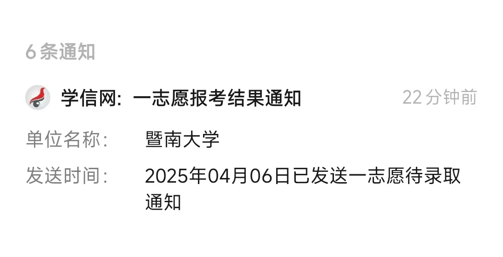

2024年终应该是在2024年末写的，但是因为考研成绩没有出来，所以拖到了现在。其实现在已经是2025年中，哈哈哈。

## 变化
2024年3月份，我又回到了深圳。回去的理由有两个：1. 我在hcd的前途和钱途，都非常不乐观。2. 深圳这边似乎非常顺利，之前的老大对我非常不错。
关于在hcd的收获，还是非常多的。认识了一些985本，美硕的顶尖人才，还有华为天才少年的师弟,拿过顶会的best paper。hcd让我做的研发任务是蛮有意义的，但无奈当时自己心态不行，相对浮躁，所以算是潦草交卷。我也在其中学到了很多，wm手把手帮我调试代码，告诉我不要跳过问题，必须要overcome, 不然你换个方法还是会遇到类似的问题。yl的技术非常高，编码的设计都是源于顶会论文。   

## 工作
目前主要是在做pdf相关的开发，学到知识还是比较多的。当然问题也比较多，所以只能告诉自己坚持下去，别放弃。

## 健身
健身是2024年解锁的新爱好。氪金就是爽，几乎可以在不花费额外的精力的情况下，解锁健身这个技能。最终的结果也是蛮不错的，体重达到了近十年的最低值。可以做引体向上了，深蹲，卧推，硬拉，等动作都有解锁。
最大的收获是让自己多了个技能，让自己的时间更有意思一点。人的生活不能太无聊，不能太枯燥。整天只会对着计算机编码，也不行。

## 学习
God bless me! 一切都很幸运，非常开心~  

 
