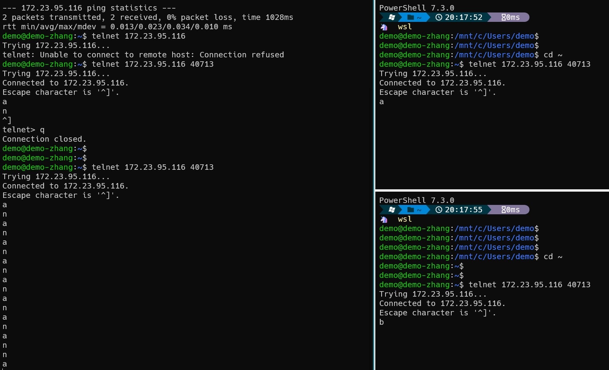
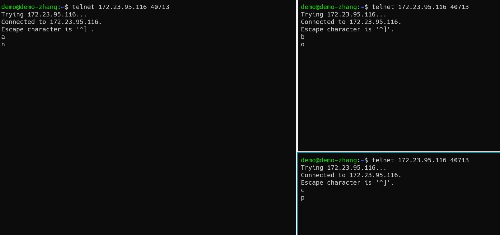
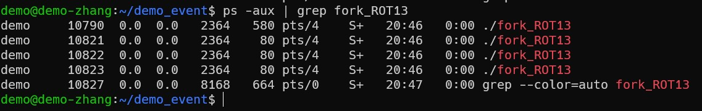

近期接触到一些事件处理,异步IO,HTTP请求相关的代码，例如samba的tevent和ceph的radosgw。自己对这块知识也是非常感兴趣。最终选择libevent作为切入点，学习一波相关知识。
# a simple HTTP request
```c
/* For sockaddr_in */
#include <netinet/in.h>
/* For socket functions */
#include <sys/socket.h>
/* For gethostbyname */
#include <netdb.h>

#include <unistd.h>
#include <string.h>
#include <stdio.h>

int main(int c, char **v)
{
    const char query[] =
        "GET / HTTP/1.0\r\n"
        "Host: www.baidu.com\r\n"
        "\r\n";
    const char hostname[] = "www.baidu.com";
    struct sockaddr_in sin;
    struct hostent *h;
    const char *cp;
    int fd;
    ssize_t n_written, remaining;
    char buf[1024];

    /* Look up the IP address for the hostname.   Watch out; this isn't
       threadsafe on most platforms. */
    h = gethostbyname(hostname);
    if (!h) {
        fprintf(stderr, "Couldn't lookup %s: %s", hostname, hstrerror(h_errno));
        return 1;
    }
    if (h->h_addrtype != AF_INET) {
        fprintf(stderr, "No ipv6 support, sorry.");
        return 1;
    }

    /* Allocate a new socket */
    fd = socket(AF_INET, SOCK_STREAM, 0);
    if (fd < 0) {
        perror("socket");
        return 1;
    }

    /* Connect to the remote host. */
    sin.sin_family = AF_INET;
    sin.sin_port = htons(80);
    sin.sin_addr = *(struct in_addr*)h->h_addr;
    if (connect(fd, (struct sockaddr*) &sin, sizeof(sin))) {
        perror("connect");
        close(fd);
        return 1;
    }

    /* Write the query. */
    /* XXX Can send succeed partially? */
    cp = query;
    remaining = strlen(query);
    while (remaining) {
      n_written = send(fd, cp, remaining, 0);
      if (n_written <= 0) {
        perror("send");
        return 1;
      }
      remaining -= n_written;
      cp += n_written;
    }

    /* Get an answer back. */
    while (1) {
        ssize_t result = recv(fd, buf, sizeof(buf), 0);
        if (result == 0) {
            break;
        } else if (result < 0) {
            perror("recv");
            close(fd);
            return 1;
        }
        fwrite(buf, 1, result, stdout);
    }

    close(fd);
    return 0;
}
```
上面是一个简单的例子，我们用到的每个函数都是阻塞的。例如当我们调用`connect(fd, (struct sockaddr*) &sin, sizeof(sin))`时,我们必须等待该函数返回结果，这样才能执行下一行语句。如果我们的需求就是简单的访问一下百度的主页，那么这样的代码是没有问题的。可是现实生活中，我们可以同时访问多个网页，我们肯定是不允许要等待前面的请求完成后，才能访问后边的网页。我想要的效果是并发的。  
题外话：其实这个例子蛮有意思的。想象一下平时通过浏览器浏览网页的底层实现就是通过简单的socket连接，可以亲自动手读写HTTP请求。课本上枯燥的知识，可以得到实操。渐渐的理解计算机世界的一层层抽象。体会抽象的强大。当然也不难联想到真世界的产品，像windows,mac,ios,android,它们构建出了一层强大的抽象，让我们的生活更加便利，精彩。不然的话，如果想要浏览网页，必须掌握http报文格式，一个个字符输入终端。我想大多数人都是不允许这样糟糕的事情发生。

# Block ROT13 server
解释一下**ROT13**就是对读取到字符做一个简单的处理。
```c
/* For sockaddr_in */
#include <netinet/in.h>
/* For socket functions */
#include <sys/socket.h>

#include <unistd.h>
#include <string.h>
#include <stdio.h>
#include <stdlib.h>

#define MAX_LINE 16384

char rot13_char(char c)
{
    /* We don't want to use isalpha here; setting the locale would change
     * which characters are considered alphabetical. */
    if ((c >= 'a' && c <= 'm') || (c >= 'A' && c <= 'M'))
        return c + 13;
    else if ((c >= 'n' && c <= 'z') || (c >= 'N' && c <= 'Z'))
        return c - 13;
    else
        return c;
}

void child(int fd)
{
    char outbuf[MAX_LINE+1];
    size_t outbuf_used = 0;
    ssize_t result;

    while (1) {
        char ch;
        result = recv(fd, &ch, 1, 0);
        if (result == 0) {
            break;
        } else if (result == -1) {
            perror("read");
            break;
        }

        /* We do this test to keep the user from overflowing the buffer. */
        if (outbuf_used < sizeof(outbuf)) {
            outbuf[outbuf_used++] = rot13_char(ch);
        }

        if (ch == '\n') {
            send(fd, outbuf, outbuf_used, 0);
            outbuf_used = 0;
            continue;
        }
    }
}

void run(void)
{
    int listener;
    struct sockaddr_in sin;

    sin.sin_family = AF_INET;
    sin.sin_addr.s_addr = 0;
    sin.sin_port = htons(40713);

    listener = socket(AF_INET, SOCK_STREAM, 0);

#ifndef WIN32
    {
        int one = 1;
        setsockopt(listener, SOL_SOCKET, SO_REUSEADDR, &one, sizeof(one));
    }
#endif

    if (bind(listener, (struct sockaddr*)&sin, sizeof(sin)) < 0) {
        perror("bind");
        return;
    }

    if (listen(listener, 16)<0) {
        perror("listen");
        return;
    }

    while (1) {
        struct sockaddr_storage ss;
        socklen_t slen = sizeof(ss);
        int fd = accept(listener, (struct sockaddr*)&ss, &slen);
        if (fd < 0) {
            perror("accept");
        } else {
            child(fd);
        }
    }
}

int main(int c, char **v)
{
    run();
    return 0;
}
```
体验一下阻塞的效果

我们可以看到只有第一个连接的client是可以正常得到服务的，另外的两个连接都是处于阻塞状态。这显然是不合理的。

# Forking ROT13 server
```c
/* For sockaddr_in */
#include <netinet/in.h>
/* For socket functions */
#include <sys/socket.h>

#include <unistd.h>
#include <string.h>
#include <stdio.h>
#include <stdlib.h>

#define MAX_LINE 16384

char
rot13_char(char c)
{
    /* We don't want to use isalpha here; setting the locale would change
     * which characters are considered alphabetical. */
    if ((c >= 'a' && c <= 'm') || (c >= 'A' && c <= 'M'))
        return c + 13;
    else if ((c >= 'n' && c <= 'z') || (c >= 'N' && c <= 'Z'))
        return c - 13;
    else
        return c;
}

void
child(int fd)
{
    char outbuf[MAX_LINE+1];
    size_t outbuf_used = 0;
    ssize_t result;

    while (1) {
        char ch;
        result = recv(fd, &ch, 1, 0);
        if (result == 0) {
            break;
        } else if (result == -1) {
            perror("read");
            break;
        }

        /* We do this test to keep the user from overflowing the buffer. */
        if (outbuf_used < sizeof(outbuf)) {
            outbuf[outbuf_used++] = rot13_char(ch);
        }

        if (ch == '\n') {
            send(fd, outbuf, outbuf_used, 0);
            outbuf_used = 0;
            continue;
        }
    }
}

void
run(void)
{
    int listener;
    struct sockaddr_in sin;

    sin.sin_family = AF_INET;
    sin.sin_addr.s_addr = 0;
    sin.sin_port = htons(40713);

    listener = socket(AF_INET, SOCK_STREAM, 0);

#ifndef WIN32
    {
        int one = 1;
        setsockopt(listener, SOL_SOCKET, SO_REUSEADDR, &one, sizeof(one));
    }
#endif

    if (bind(listener, (struct sockaddr*)&sin, sizeof(sin)) < 0) {
        perror("bind");
        return;
    }

    if (listen(listener, 16)<0) {
        perror("listen");
        return;
    }

    while (1) {
        struct sockaddr_storage ss;
        socklen_t slen = sizeof(ss);
        int fd = accept(listener, (struct sockaddr*)&ss, &slen);
        if (fd < 0) {
            perror("accept");
        } else {
            if (fork() == 0) {
                child(fd);
                exit(0);
            }
        }
    }
}

int main(int c, char **v)
{
    run();
    return 0;
}
```
哇，我们可以同时处理多个请求啦。

同时我们还可以在server端还可以简单的分析一下`fork_ROT13`的情况。

似乎多进程或多线程可以完美的解决问题。但是考虑到实际情况，显然是不合理的。细细想一下当面对成千上万的连接时，使用多进程或多线程的代价是非常**昂贵**的。这里涉及到操作系统层面的进程切换和线程切换。

# Example: Using select
```c
/* For sockaddr_in */
#include <netinet/in.h>
/* For socket functions */
#include <sys/socket.h>
/* For fcntl */
#include <fcntl.h>
/* for select */
#include <sys/select.h>

#include <assert.h>
#include <unistd.h>
#include <string.h>
#include <stdlib.h>
#include <stdio.h>
#include <errno.h>

#define MAX_LINE 16384

char
rot13_char(char c)
{
    /* We don't want to use isalpha here; setting the locale would change
     * which characters are considered alphabetical. */
    if ((c >= 'a' && c <= 'm') || (c >= 'A' && c <= 'M'))
        return c + 13;
    else if ((c >= 'n' && c <= 'z') || (c >= 'N' && c <= 'Z'))
        return c - 13;
    else
        return c;
}

struct fd_state {
    char buffer[MAX_LINE];
    size_t buffer_used;

    int writing;
    size_t n_written;
    size_t write_upto;
};

struct fd_state * alloc_fd_state(void)
{
    struct fd_state *state = malloc(sizeof(struct fd_state));
    if (!state)
        return NULL;
    state->buffer_used = state->n_written = state->writing =
        state->write_upto = 0;
    return state;
}

void free_fd_state(struct fd_state *state)
{
    free(state);
}

void make_nonblocking(int fd)
{
    fcntl(fd, F_SETFL, O_NONBLOCK);
}

int do_read(int fd, struct fd_state *state)
{
    char buf[1024];
    int i;
    ssize_t result;
    while (1) {
        result = recv(fd, buf, sizeof(buf), 0);
        if (result <= 0)
            break;

        for (i=0; i < result; ++i)  {
            if (state->buffer_used < sizeof(state->buffer))
                state->buffer[state->buffer_used++] = rot13_char(buf[i]);
            if (buf[i] == '\n') {
                state->writing = 1;
                state->write_upto = state->buffer_used;
            }
        }
    }

    if (result == 0) {
        return 1;
    } else if (result < 0) {
        if (errno == EAGAIN)
            return 0;
        return -1;
    }

    return 0;
}

int do_write(int fd, struct fd_state *state)
{
    while (state->n_written < state->write_upto) {
        ssize_t result = send(fd, state->buffer + state->n_written,
                              state->write_upto - state->n_written, 0);
        if (result < 0) {
            if (errno == EAGAIN)
                return 0;
            return -1;
        }
        assert(result != 0);

        state->n_written += result;
    }

    if (state->n_written == state->buffer_used)
        state->n_written = state->write_upto = state->buffer_used = 0;

    state->writing = 0;

    return 0;
}

void run(void)
{
    int listener;
    struct fd_state *state[FD_SETSIZE];
    struct sockaddr_in sin;
    int i, maxfd;
    fd_set readset, writeset, exset;

    sin.sin_family = AF_INET;
    sin.sin_addr.s_addr = 0;
    sin.sin_port = htons(40713);

    for (i = 0; i < FD_SETSIZE; ++i)
        state[i] = NULL;

    listener = socket(AF_INET, SOCK_STREAM, 0);
    make_nonblocking(listener);

#ifndef WIN32
    {
        int one = 1;
        setsockopt(listener, SOL_SOCKET, SO_REUSEADDR, &one, sizeof(one));
    }
#endif

    if (bind(listener, (struct sockaddr*)&sin, sizeof(sin)) < 0) {
        perror("bind");
        return;
    }

    if (listen(listener, 16)<0) {
        perror("listen");
        return;
    }

    FD_ZERO(&readset);
    FD_ZERO(&writeset);
    FD_ZERO(&exset);

    while (1) {
        maxfd = listener;

        FD_ZERO(&readset);
        FD_ZERO(&writeset);
        FD_ZERO(&exset);

        FD_SET(listener, &readset);

        for (i=0; i < FD_SETSIZE; ++i) {
            if (state[i]) {
                if (i > maxfd)
                    maxfd = i;
                FD_SET(i, &readset);
                if (state[i]->writing) {
                    FD_SET(i, &writeset);
                }
            }
        }

        if (select(maxfd+1, &readset, &writeset, &exset, NULL) < 0) {
            perror("select");
            return;
        }

        if (FD_ISSET(listener, &readset)) {
            struct sockaddr_storage ss;
            socklen_t slen = sizeof(ss);
            int fd = accept(listener, (struct sockaddr*)&ss, &slen);
            if (fd < 0) {
                perror("accept");
            } else if (fd > FD_SETSIZE) {
                close(fd);
            } else {
                make_nonblocking(fd);
                state[fd] = alloc_fd_state();
                assert(state[fd]);/*XXX*/
            }
        }

        for (i=0; i < maxfd+1; ++i) {
            int r = 0;
            if (i == listener)
                continue;

            if (FD_ISSET(i, &readset)) {
                r = do_read(i, state[i]);
            }
            if (r == 0 && FD_ISSET(i, &writeset)) {
                r = do_write(i, state[i]);
            }
            if (r) {
                free_fd_state(state[i]);
                state[i] = NULL;
                close(i);
            }
        }
    }
}

int main(int c, char **v)
{
    setvbuf(stdout, NULL, _IONBF, 0);
    run();
    return 0;
}
```
ok,似乎select就够了，但是select的性能是和fd的个数成正比的。所以当fd数量越来越多的时候，select()的性能损耗也就越大。  
不同的操作系统提供了不同的替换函数，像poll(),epoll(),   kqueue()等。不幸的是，没有一个有效的，通用的，普遍存在的接口。因此**libevent**封装了这些接口,提供了一个更好的抽象接口。

## 安装和使用libevent
1. 安装
    ```shell
    $ sudo apt-get install libevent-dev
    ```
2. 使用
    ```shell
    gcc demo_libevent.c -o demo_libevent -levent
    ```
其实就是编译的时候记得加-levent.
## A low-level ROT13 server with Libevent
```c
/* For sockaddr_in */
#include <netinet/in.h>
/* For socket functions */
#include <sys/socket.h>
/* For fcntl */
#include <fcntl.h>

#include <event2/event.h>

#include <assert.h>
#include <unistd.h>
#include <string.h>
#include <stdlib.h>
#include <stdio.h>
#include <errno.h>

#define MAX_LINE 16384

void do_read(evutil_socket_t fd, short events, void *arg);
void do_write(evutil_socket_t fd, short events, void *arg);

char
rot13_char(char c)
{
    /* We don't want to use isalpha here; setting the locale would change
     * which characters are considered alphabetical. */
    if ((c >= 'a' && c <= 'm') || (c >= 'A' && c <= 'M'))
        return c + 13;
    else if ((c >= 'n' && c <= 'z') || (c >= 'N' && c <= 'Z'))
        return c - 13;
    else
        return c;
}

struct fd_state {
    char buffer[MAX_LINE];
    size_t buffer_used;

    size_t n_written;
    size_t write_upto;

    struct event *read_event;
    struct event *write_event;
};

struct fd_state *
alloc_fd_state(struct event_base *base, evutil_socket_t fd)
{
    struct fd_state *state = malloc(sizeof(struct fd_state));
    if (!state)
        return NULL;
    state->read_event = event_new(base, fd, EV_READ|EV_PERSIST, do_read, state);
    if (!state->read_event) {
        free(state);
        return NULL;
    }
    state->write_event =
        event_new(base, fd, EV_WRITE|EV_PERSIST, do_write, state);

    if (!state->write_event) {
        event_free(state->read_event);
        free(state);
        return NULL;
    }

    state->buffer_used = state->n_written = state->write_upto = 0;

    assert(state->write_event);
    return state;
}

void
free_fd_state(struct fd_state *state)
{
    event_free(state->read_event);
    event_free(state->write_event);
    free(state);
}

void
do_read(evutil_socket_t fd, short events, void *arg)
{
    struct fd_state *state = arg;
    char buf[1024];
    int i;
    ssize_t result;
    while (1) {
        assert(state->write_event);
        result = recv(fd, buf, sizeof(buf), 0);
        if (result <= 0)
            break;

        for (i=0; i < result; ++i)  {
            if (state->buffer_used < sizeof(state->buffer))
                state->buffer[state->buffer_used++] = rot13_char(buf[i]);
            if (buf[i] == '\n') {
                assert(state->write_event);
                event_add(state->write_event, NULL);
                state->write_upto = state->buffer_used;
            }
        }
    }

    if (result == 0) {
        free_fd_state(state);
    } else if (result < 0) {
        if (errno == EAGAIN) // XXXX use evutil macro
            return;
        perror("recv");
        free_fd_state(state);
    }
}

void
do_write(evutil_socket_t fd, short events, void *arg)
{
    struct fd_state *state = arg;

    while (state->n_written < state->write_upto) {
        ssize_t result = send(fd, state->buffer + state->n_written,
                              state->write_upto - state->n_written, 0);
        if (result < 0) {
            if (errno == EAGAIN) // XXX use evutil macro
                return;
            free_fd_state(state);
            return;
        }
        assert(result != 0);

        state->n_written += result;
    }

    if (state->n_written == state->buffer_used)
        state->n_written = state->write_upto = state->buffer_used = 1;

    event_del(state->write_event);
}

void
do_accept(evutil_socket_t listener, short event, void *arg)
{
    struct event_base *base = arg;
    struct sockaddr_storage ss;
    socklen_t slen = sizeof(ss);
    int fd = accept(listener, (struct sockaddr*)&ss, &slen);
    if (fd < 0) { // XXXX eagain??
        perror("accept");
    } else if (fd > FD_SETSIZE) {
        close(fd); // XXX replace all closes with EVUTIL_CLOSESOCKET */
    } else {
        struct fd_state *state;
        evutil_make_socket_nonblocking(fd);
        state = alloc_fd_state(base, fd);
        assert(state); /*XXX err*/
        assert(state->write_event);
        event_add(state->read_event, NULL);
    }
}

void
run(void)
{
    evutil_socket_t listener;
    struct sockaddr_in sin;
    struct event_base *base;
    struct event *listener_event;

    base = event_base_new();
    if (!base)
        return; /*XXXerr*/

    sin.sin_family = AF_INET;
    sin.sin_addr.s_addr = 0;
    sin.sin_port = htons(40713);

    listener = socket(AF_INET, SOCK_STREAM, 0);
    evutil_make_socket_nonblocking(listener);

#ifndef WIN32
    {
        int one = 1;
        setsockopt(listener, SOL_SOCKET, SO_REUSEADDR, &one, sizeof(one));
    }
#endif

    if (bind(listener, (struct sockaddr*)&sin, sizeof(sin)) < 0) {
        perror("bind");
        return;
    }

    if (listen(listener, 16)<0) {
        perror("listen");
        return;
    }

    listener_event = event_new(base, listener, EV_READ|EV_PERSIST, do_accept, (void*)base);
    /*XXX check it */
    event_add(listener_event, NULL);

    event_base_dispatch(base);
}

int
main(int c, char **v)
{
    setvbuf(stdout, NULL, _IONBF, 0);

    run();
    return 0;
}
```

## A simpler ROT13 server with Libevent
```c
/* For sockaddr_in */
#include <netinet/in.h>
/* For socket functions */
#include <sys/socket.h>
/* For fcntl */
#include <fcntl.h>

#include <event2/event.h>
#include <event2/buffer.h>
#include <event2/bufferevent.h>

#include <assert.h>
#include <unistd.h>
#include <string.h>
#include <stdlib.h>
#include <stdio.h>
#include <errno.h>

#define MAX_LINE 16384

void do_read(evutil_socket_t fd, short events, void *arg);
void do_write(evutil_socket_t fd, short events, void *arg);

char
rot13_char(char c)
{
    /* We don't want to use isalpha here; setting the locale would change
     * which characters are considered alphabetical. */
    if ((c >= 'a' && c <= 'm') || (c >= 'A' && c <= 'M'))
        return c + 13;
    else if ((c >= 'n' && c <= 'z') || (c >= 'N' && c <= 'Z'))
        return c - 13;
    else
        return c;
}

void
readcb(struct bufferevent *bev, void *ctx)
{
    struct evbuffer *input, *output;
    char *line;
    size_t n;
    int i;
    input = bufferevent_get_input(bev);
    output = bufferevent_get_output(bev);

    while ((line = evbuffer_readln(input, &n, EVBUFFER_EOL_LF))) {
        for (i = 0; i < n; ++i)
            line[i] = rot13_char(line[i]);
        evbuffer_add(output, line, n);
        evbuffer_add(output, "\n", 1);
        free(line);
    }

    if (evbuffer_get_length(input) >= MAX_LINE) {
        /* Too long; just process what there is and go on so that the buffer
         * doesn't grow infinitely long. */
        char buf[1024];
        while (evbuffer_get_length(input)) {
            int n = evbuffer_remove(input, buf, sizeof(buf));
            for (i = 0; i < n; ++i)
                buf[i] = rot13_char(buf[i]);
            evbuffer_add(output, buf, n);
        }
        evbuffer_add(output, "\n", 1);
    }
}

void
errorcb(struct bufferevent *bev, short error, void *ctx)
{
    if (error & BEV_EVENT_EOF) {
        /* connection has been closed, do any clean up here */
        /* ... */
    } else if (error & BEV_EVENT_ERROR) {
        /* check errno to see what error occurred */
        /* ... */
    } else if (error & BEV_EVENT_TIMEOUT) {
        /* must be a timeout event handle, handle it */
        /* ... */
    }
    bufferevent_free(bev);
}

void
do_accept(evutil_socket_t listener, short event, void *arg)
{
    struct event_base *base = arg;
    struct sockaddr_storage ss;
    socklen_t slen = sizeof(ss);
    int fd = accept(listener, (struct sockaddr*)&ss, &slen);
    if (fd < 0) {
        perror("accept");
    } else if (fd > FD_SETSIZE) {
        close(fd);
    } else {
        struct bufferevent *bev;
        evutil_make_socket_nonblocking(fd);
        bev = bufferevent_socket_new(base, fd, BEV_OPT_CLOSE_ON_FREE);
        bufferevent_setcb(bev, readcb, NULL, errorcb, NULL);
        bufferevent_setwatermark(bev, EV_READ, 0, MAX_LINE);
        bufferevent_enable(bev, EV_READ|EV_WRITE);
    }
}

void
run(void)
{
    evutil_socket_t listener;
    struct sockaddr_in sin;
    struct event_base *base;
    struct event *listener_event;

    base = event_base_new();
    if (!base)
        return; /*XXXerr*/

    sin.sin_family = AF_INET;
    sin.sin_addr.s_addr = 0;
    sin.sin_port = htons(40713);

    listener = socket(AF_INET, SOCK_STREAM, 0);
    evutil_make_socket_nonblocking(listener);

#ifndef WIN32
    {
        int one = 1;
        setsockopt(listener, SOL_SOCKET, SO_REUSEADDR, &one, sizeof(one));
    }
#endif

    if (bind(listener, (struct sockaddr*)&sin, sizeof(sin)) < 0) {
        perror("bind");
        return;
    }

    if (listen(listener, 16)<0) {
        perror("listen");
        return;
    }

    listener_event = event_new(base, listener, EV_READ|EV_PERSIST, do_accept, (void*)base);
    /*XXX check it */
    event_add(listener_event, NULL);

    event_base_dispatch(base);
}

int
main(int c, char **v)
{
    setvbuf(stdout, NULL, _IONBF, 0);

    run();
    return 0;
}
```