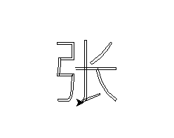

## 计算机是怎么显示字体的？
### 简化解释
计算机显示字体的过程涉及多个步骤和技术，从字符编码到图形渲染。以下是一个简化的解释：
1. **字符编码**：
   - 计算机内部使用特定的编码（如ASCII、Unicode）来表示文本字符。每个字符对应一个唯一的代码点。

2. **字体文件**：
   - 字体文件（如TrueType（.ttf）、OpenType（.otf））包含了字符的轮廓信息、度量信息和其他元数据。这些文件描述了每个字符的形状和大小。

3. **字体渲染引擎**：
   - 字体渲染引擎（如FreeType）负责将字体文件中的字符轮廓转换为可显示的位图或矢量图形。
   - 该引擎读取字体文件，解析字符轮廓，并进行缩放、平滑处理（抗锯齿）等操作。

4. **文字布局**：
   - 在将文本显示在屏幕上之前，计算机需要确定每个字符的确切位置。这涉及处理字距调整（Kerning）、行距调整和复杂脚本的布局（如阿拉伯文、印地语等）。
   - 一些高级布局引擎（如HarfBuzz）会处理这些复杂的布局任务。

5. **光栅化**：
   - 光栅化是将矢量图形转换为像素位图的过程。字体渲染引擎通过扫描转换技术将字符的矢量轮廓转换为像素阵列。

6. **显示**：
   - 最终，计算机将生成的位图或者矢量图形发送到显示设备（如屏幕）。图形系统（如Windows的GDI、macOS的Quartz、Linux的X Window System）会处理最终的显示工作。 
### 详细步骤示例

1. **字符输入**：
   - 用户输入字符，比如"A"。
   - 该字符被转换为对应的编码（如Unicode编码U+0041）。

2. **选择字体**：
   - 系统根据用户设置或应用程序默认设置选择一个字体文件（如Arial.ttf）。

3. **读取字符轮廓**：
   - 字体渲染引擎（如FreeType）读取Arial.ttf文件中的数据，找到字符"A"的轮廓信息。

4. **缩放和平滑处理**：
   - 字体渲染引擎根据当前的显示分辨率和大小设置，对字符轮廓进行缩放和平滑处理，以避免锯齿边缘。

5. **光栅化**：
   - 字符轮廓被转换为位图，这意味着"A"的形状被转换成一系列黑白像素。

6. **显示输出**：
   - 位图被送到图形系统，图形系统将其绘制到屏幕上的指定位置，用户最终看到显示在屏幕上的字符"A"。


## 什么是轮廓信息？
字符轮廓（Character Outline）是指用于描述字体中每个字符形状的矢量数据。与位图字体不同，矢量字体使用数学曲线和直线来定义字符的形状，因此可以在不同尺寸和分辨率下进行无损缩放。字符轮廓通常由一系列控制点和曲线（如贝塞尔曲线）组成。

### 字符轮廓的组成

1. **控制点（Control Points）**：
   - 控制点是定义曲线和直线的关键点。它们决定了字符轮廓的形状。

2. **线段和曲线**：
   - 线段：由两个控制点之间的直线段组成。
   - 曲线：通常由贝塞尔曲线或其他曲线形式定义，贝塞尔曲线是通过起点、终点和一个或多个控制点来定义的。

### 字符轮廓的生成过程

1. **设计**：
   - 字体设计师使用字体设计软件（如Adobe Illustrator、FontLab、Glyphs）绘制字符的轮廓。设计师使用控制点和曲线来创建每个字符的形状。

2. **存储**：
   - 设计好的字符轮廓被存储在字体文件中（如TrueType或OpenType文件）。这些文件包含了字符的轮廓信息、度量信息（如字符的高度、宽度、间距等）以及其他元数据。

3. **渲染**：
   - 当需要在屏幕上显示字符时，字体渲染引擎会读取字体文件中的轮廓信息，并根据显示设备的分辨率和字体大小进行缩放和光栅化处理。

### 光栅化过程

光栅化是将字符轮廓转换为像素图像的过程。它通常包括以下步骤：

1. **缩放**：
   - 根据显示尺寸和分辨率，将字符轮廓按比例缩放。

2. **扫描转换**：
   - 将矢量轮廓转换为栅格位图。扫描转换是通过将轮廓填充为像素网格来完成的。

3. **抗锯齿**：
   - 应用抗锯齿技术，以平滑字符边缘，减少锯齿效应，使字符看起来更清晰和光滑。

### 优点

使用字符轮廓有以下优点：

1. **可缩放性**：
   - 由于字符轮廓是矢量数据，可以在任何尺寸和分辨率下无损缩放。

2. **清晰度**：
   - 通过抗锯齿技术，可以使字符边缘更加平滑，提升文本的可读性。

3. **灵活性**：
   - 矢量字体可以轻松地进行变形、旋转和其他操作，适用于各种排版需求。

### 例子

以下是一个简单的字母"A"的字符轮廓示例：

- 字母"A"的轮廓可能由三部分组成：两个斜边和一个横杠。
- 斜边和横杠可以通过控制点和贝塞尔曲线来定义。

```plaintext
A
 /\
/  \
|--|
```

在字体文件中，字母"A"的轮廓信息可能被存储为：

- 斜边：从控制点（0,0）到（50,100）和（50,100）到（100,0）
- 横杠：从控制点（25,50）到（75,50）

这些控制点和线段定义了字母"A"的形状，字体渲染引擎会根据这些数据生成实际的位图图像，以供显示。

## 实践
ok,理论大概讲完了，那么我们能不能实践一下呢？我想用python读取字体文件的信息;并用很简单的，很入门的图形库[trutle](https://docs.python.org/3/library/turtle.html)(第一次知道这个库是在大学里的第一堂python课上，怀念~)，去抽象出画笔。

```python
import turtle
from fontTools.ttLib import TTFont
from fontTools.pens.basePen import BasePen

class SimplePen(BasePen):
    def __init__(self, glyphSet):
        super().__init__(glyphSet)
        self.path = []

    def _moveTo(self, p0):
        self.path.append(('moveTo', p0))

    def _lineTo(self, p1):
        self.path.append(('lineTo', p1))

    def _curveToOne(self, p1, p2, p3):
        self.path.append(('curveTo', (p1, p2, p3)))

    def _closePath(self):
        self.path.append(('closePath',))

def get_glyph_outline(font_path, unicode_char):
    # 打开字体文件
    font = TTFont(font_path)

    # 获取字形集
    glyphSet = font.getGlyphSet()

    # 获取字符的字形ID
    cmap = font.getBestCmap()
    glyph_id = cmap[ord(unicode_char)]

    # 获取指定字形
    glyph = glyphSet[glyph_id]

    # 使用SimplePen提取轮廓信息
    pen = SimplePen(glyphSet)
    glyph.draw(pen)

    return pen.path

def draw_outline_with_turtle(outline, scale=1.0, offset=(0, 0)):
    # 初始化turtle
    turtle.speed(1)
    turtle.penup()

    for command in outline:
        if command[0] == 'moveTo':
            x, y = command[1]
            turtle.goto(scale * x + offset[0], scale * y + offset[1])
            turtle.pendown()
        elif command[0] == 'lineTo':
            x, y = command[1]
            turtle.goto(scale * x + offset[0], scale * y + offset[1])
        elif command[0] == 'curveTo':
            # 贝塞尔曲线的绘制需要进一步处理，这里我们只绘制直线近似
            # 获取曲线的终点
            _, _, end_point = command[1]
            x, y = end_point
            turtle.goto(scale * x + offset[0], scale * y + offset[1])
        elif command[0] == 'closePath':
            turtle.penup()

    turtle.done()

# 示例：读取SimSun字体中的汉字“好”的轮廓信息
font_path = 'Noto_Sans_SC/NotoSansSC-VariableFont_wght.ttf'  # 替换为你的字体文件路径
unicode_char = '张'

outline = get_glyph_outline(font_path, unicode_char)

# 调整绘图比例和起点位置，使其在屏幕中心显示
scale = 0.1
offset = (-200, 0)  # 根据需要调整偏移量以将字符放置在适当位置

# 使用turtle绘制轮廓
draw_outline_with_turtle(outline, scale=scale, offset=offset)

```
效果展示：  
