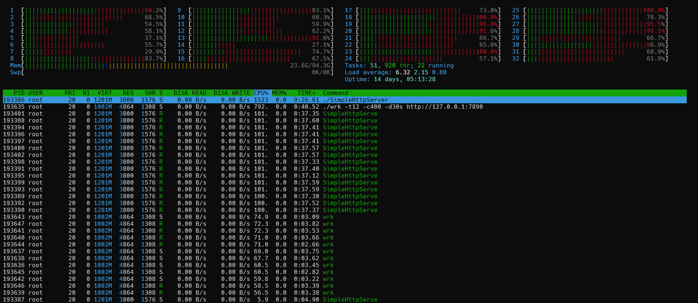
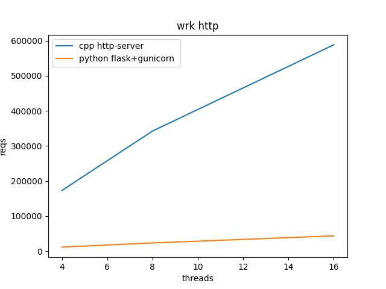

# 性能测试的重要性
因为最近用到的性能测试工具比较多，例如[**fio**](https://github.com/axboe/fio), [**wrk**](https://github.com/wg/wrk)。所以难免有一些感慨。
计算机是一个严格的科学工具，里边没有黑魔法，里边所有的东西都是可以测量的。什么是科学？科学具有可证伪性，可检验性。有个有趣的段子：
```
你要是推翻西医里的理论，那是可以拿诺奖的。
你要是推翻中医里的理论。那后果...
```
回忆之前在课本里学到了很多概念，例如时间复杂度分析，学的时候觉得很枯燥，彷佛用不上。平时自己写的小程序，在自己的个人电脑上也都是瞬间执行结束的。根本体会不到时间复杂度的重要性。直到我在leetcode上遇到1G的数据量时，我才真正的体会到了时间复杂度的重要。
```python
>>> log(10**9,2)
29.897352853986263
>>> 10**9 / log(10**9,2)
33447777.29599791
```
不知道，你有没有对这个计算结果吃惊呢？  
有的时候我就在想：是计算机太快了，绝大多数普通人是感受不到毫秒级的延迟的。当然更重要的是好多人也不会遇到这样的问题，毕竟能有百万并发的场景是少数大厂。既然遇不到这样的问题，那么所有的知识，就会变得枯燥。  
**Latency Numbers Every Programmer Should Know**


**anyway**所有的东西都是可以测试的，可以通过数学去计算，度量的。去分析瓶颈在哪里，看**Htop**, **火焰图**，**iostat**,最后分析讨论该怎么优化。  
记得用成熟的工具去测试，否则盲目的人肉测试是不科学的。

# Http性能测试
无意中发现了一个非常simple的[http-server](https://github.com/trungams/http-server), 还是那句话，http的本质是确定格式的文本读写。

```shell
wrk -t12 -c400 -d30s http://127.0.0.1:7890
```
结果
```
Running 30s test @ http://127.0.0.1:7890
  12 threads and 400 connections
  Thread Stats   Avg      Stdev     Max   +/- Stdev
    Latency   800.64us    3.95ms 202.80ms   99.83%
    Req/Sec    47.56k     5.41k   98.40k    89.10%
  17068381 requests in 30.10s, 1.24GB read
Requests/sec: 567065.38
Transfer/sec:     42.18MB
```
Htop


对比一下之前的常用的[**Flask**](https://github.com/pallets/flask)

```shell
(venv) [root@node1 demo-flask]# python demo.py
 * Serving Flask app 'demo' (lazy loading)
 * Environment: production
   WARNING: This is a development server. Do not use it in a production deployment.
   Use a production WSGI server instead.
 * Debug mode: off
 * Running on http://127.0.0.1:5000/ (Press CTRL+C to quit
```
```shell
[root@node1 wrk]# ./wrk -t12 -c400 -d30s http://127.0.0.1:5000
Running 30s test @ http://127.0.0.1:5000
  12 threads and 400 connections
  Thread Stats   Avg      Stdev     Max   +/- Stdev
    Latency   284.32ms  178.98ms   1.96s    81.05%
    Req/Sec    71.11     42.46   292.00     73.87%
  24828 requests in 30.03s, 3.93MB read
  Socket errors: connect 0, read 0, write 0, timeout 131
Requests/sec:    826.80
Transfer/sec:    134.03KB
```

加上WSGI
* 四进程
```shell
(venv) [root@node1 demo-flask]# gunicorn -w 4 -k gevent demo:app -b :7889
[2024-03-13 08:49:25 +0000] [220624] [INFO] Starting gunicorn 21.2.0
[2024-03-13 08:49:25 +0000] [220624] [INFO] Listening at: http://0.0.0.0:7889 (220624)
[2024-03-13 08:49:25 +0000] [220624] [INFO] Using worker: gevent
[2024-03-13 08:49:25 +0000] [220627] [INFO] Booting worker with pid: 220627
[2024-03-13 08:49:25 +0000] [220628] [INFO] Booting worker with pid: 220628
[2024-03-13 08:49:25 +0000] [220629] [INFO] Booting worker with pid: 220629
[2024-03-13 08:49:26 +0000] [220630] [INFO] Booting worker with pid: 220630
```
```
[root@node1 wrk]# ./wrk -t12 -c400 -d30s http://127.0.0.1:7889
Running 30s test @ http://127.0.0.1:7889
  12 threads and 400 connections
  Thread Stats   Avg      Stdev     Max   +/- Stdev
    Latency    24.68ms  147.52ms   2.00s    96.66%
    Req/Sec     3.44k     3.16k   11.86k    53.42%
  353945 requests in 30.04s, 57.72MB read
  Socket errors: connect 0, read 0, write 0, timeout 502
Requests/sec:  11782.63
Transfer/sec:      1.92MB
```
* 八进程
```
[root@node1 wrk]# ./wrk -t12 -c400 -d30s http://127.0.0.1:7889
Running 30s test @ http://127.0.0.1:7889
  12 threads and 400 connections
  Thread Stats   Avg      Stdev     Max   +/- Stdev
    Latency    13.29ms  107.98ms   2.00s    98.02%
    Req/Sec     4.49k     2.79k   17.94k    71.28%
  709308 requests in 30.04s, 115.67MB read
  Socket errors: connect 0, read 11, write 0, timeout 445
Requests/sec:  23612.98
Transfer/sec:      3.85MB
```
* 十六进程
```
[root@node1 wrk]# ./wrk -t12 -c400 -d30s http://127.0.0.1:7889
Running 30s test @ http://127.0.0.1:7889
  12 threads and 400 connections
  Thread Stats   Avg      Stdev     Max   +/- Stdev
    Latency    86.79ms  283.99ms   2.00s    91.56%
    Req/Sec     4.73k     3.01k   28.13k    67.26%
  1318602 requests in 30.10s, 215.04MB read
  Socket errors: connect 0, read 0, write 0, timeout 1732
Requests/sec:  43807.48
Transfer/sec:      7.14MB
```
总结
